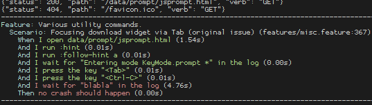

###############################################
Day 2: More pull requests and nicer test output
###############################################

:category: webengine
:tags: pytest

*****************
Better BDD output
*****************

Yesterday evening, a contributor had a nice `idea`_ of a better output for
`BDD`_ style tests when they fail.

.. _idea: https://github.com/The-Compiler/qutebrowser/pull/1552#issuecomment-224047282
.. _BDD: https://en.wikipedia.org/wiki/Behavior_Driven_Development

qutebrowser tests a lot of functionality using end-to-end tests which are
written using the `Gherkin`_ language with the `pytest-bdd`_ plugin. Those look
like this:

.. _Gherkin: https://en.wikipedia.org/wiki/Gherkin_(software)
.. _pytest-bdd: https://github.com/pytest-dev/pytest-bdd

.. code-block:: gherkin

    Scenario: Going back without history
        Given I open data/backforward/1.txt
        When I run :back
        Then the error "At beginning of history." should be shown

BDD tests work by spawning a local webserver, spawning a qutebrowser process,
sending commands to it, and parsing its log.

If such a scenario fails however, you only can see what failed in the
underlying python code. I improved the output to add this:

``pytest-bdd`` made this easy by adding a ``scenario`` attribute to pytest's
`TestReport`_ object:

.. code-block:: python

   (Pdb++) pp report.scenario
   {'examples': [],
    'feature': {
        'description': '',
        'filename': '/home/me/.../tests/end2end/features/misc.feature',
        'line_number': 1,
        'name': 'Various utility commands.',
        'rel_filename': 'features/misc.feature',
        'tags': []
    },
    'line_number': 367,
    'name': 'Focusing download widget via Tab (original issue)',
    'steps': [{
                  'duration': 0.05486869812011719,
                  'failed': False,
                  'keyword': 'When',
                  'line_number': 368,
                  'name': 'I open data/prompt/jsprompt.html',
                  'type': 'when'
              },
              ...
    ],
    'tags': ['pyqt531_or_newer']}

Using pytest's `hook system`_, all I needed to do is adding this to my
``conftest.py`` (with colorizing code removed to simplify things a bit, see
the `full code`_ for details):

.. _hook system: http://pytest.org/latest/writing_plugins.html
.. _full code: https://github.com/The-Compiler/qutebrowser/blob/master/tests/end2end/features/conftest.py

.. code-block:: python

   @pytest.hookimpl(hookwrapper=True)
   def pytest_runtest_makereport(item, call):
       """Add a BDD section to the test output."""
       outcome = yield
       if call.when not in ['call', 'teardown']:
           return
       report = outcome.get_result()
   
       if report.passed:
           return
   
       if (not hasattr(report.longrepr, 'addsection') or
               not hasattr(report, 'scenario')):
           return

       output = []
       output.append("Feature: {name}".format(
           name=report.scenario['feature']['name'],
       ))
       output.append(
           "  Scenario: {name} ({filename}:{line})".format(
               name=report.scenario['name'],
               filename=report.scenario['feature']['rel_filename'],
               line=report.scenario['line_number'])
       )
       for step in report.scenario['steps']:
           output.append(
               "    {keyword} {name} ({duration:.2f}s)".format(
                   keyword=step['keyword'],
                   name=step['name'],
                   duration=step['duration'],
           )
   
       report.longrepr.addsection("BDD scenario", '\n'.join(output))

.. _TestReport: http://pytest.org/latest/writing_plugins.html#_pytest.runner.TestReport
.. _hook system: http://pytest.org/latest/writing_plugins.html

********************
Hinting improvements
********************

Today I was mostly busy with merging a half-year old `pull request`_ with
various hint improvements which was missing tests, and the author of it didn't
have the time to add them currently.

To make things easier, I reviewed and cherry-picked the individual commits one
by one, and then added tests for them. See the `resulting merge`_ if you're
curious.

.. _pull request: https://github.com/The-Compiler/qutebrowser/pull/1194
.. _resulting merge: https://github.com/The-Compiler/qutebrowser/compare/b759f481c4ca242451e8f6539e6d594c9c07295c...b972acf20c5d4b9ad0f03adfdb8af2f1300bac51

This improves a variety of things related to hinting, most of them when using
number hints:

- New `hints -> auto-follow-timeout` setting to ignore keypresses after
  following a hint when filtering in number mode.
- Number hints are now kept filtered after following a hint in rapid mode.
- Number hints are now renumbered after filtering
- Number hints can now be filtered with multiple space-separated search terms
- `hints -> scatter` is now ignored for number hints
- Fixed handling of backspace in number hinting mode

Currently it's looking like I have three pull requests left to merge tomorrow,
one of them being a trivial doc update about Debian packages which is ready to
merge, but I'll merge it shortly before the release.

***********
Other fixes
***********

I also pushed two other small fixes today:

- `A fix for parsing newer pdfjs version numbers <https://github.com/The-Compiler/qutebrowser/commit/e8123bb68ac019deab7ff32223ae3214323dd31c>`_
- `A fix for FileNotFoundError sometimes being raised on start with older Qt versions <https://github.com/The-Compiler/qutebrowser/commit/9880f5bd5f94498b233539c6c9588225c10b77bc>`_
